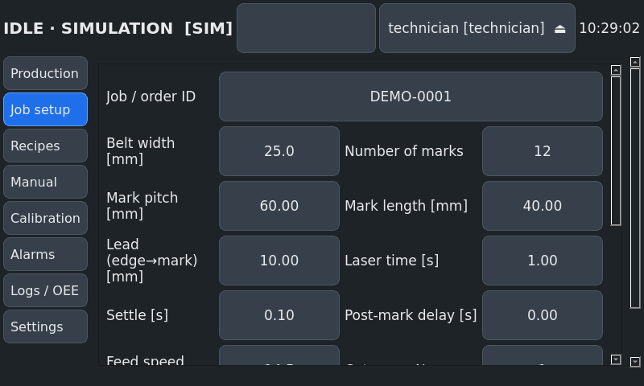
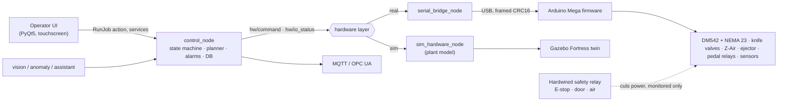

# Belt Marking Machine with CO2 Laser Integration

**An industrial, simulation-first control system for a belt / label marking machine.**
A stepper-driven conveyor feeds the belt and positions each label under one or more
laser marking machines. The system triggers the laser through its foot-pedal input,
waits until it has finished, and cuts pieces with a pneumatic knife. It runs on
**ROS 2 Humble** (Raspberry Pi + touchscreen) with an **Arduino Mega** as the real-time
I/O controller, and has a complete **Gazebo Fortress** digital twin.


| Operator UI (800×480 touchscreen, running against the simulation) | |
|---|---|
|  |  |

> **About the name.** The repository is called *…-laser-fiber* for historical reasons. The
> installed machine uses a **CO2 laser**, and this documentation describes CO2 throughout.
> The laser is integrated only through an abstract `LaserInterface` (trigger + busy/done),
> so a fiber (or UV) laser can be used without changes to the control logic.

---

## History

| Period | Work |
|---|---|
| 12/2019 – 01/2020 | Original machine by AIBO Mechatronics: maintenance and calibration, control PCB and cabinet (SolidWorks, laser-cut + 3D-printed), blocking Arduino sketch, Processing UI on a Windows PC. Preserved in [`legacy/`](legacy/README.md), analysed in [`docs/LEGACY_ANALYSIS.md`](docs/LEGACY_ANALYSIS.md) |
| 2026 | This upgrade: ROS 2 architecture, non-blocking firmware with watchdog and interlocks, PackML state machine, touchscreen UI, Gazebo twin, 12 automated industrial scenarios, CI, deployment and commissioning documentation, AI modules |

## Features

- **Job modes**: continuous marking, cut every piece, cut every N marks (sets), cut at end of batch; optional trim cut
- **Several laser machines in sync**: up to 4 stations along the conveyor with individual offsets and delays
- **Different belt widths** via recipes (validated against the machine limits)
- **Laser synchronisation**: dry-contact relay across the pedal; completion by the laser's *done/busy* signal or by time, with timeout alarms
- **PackML / ISA-88 state machine** (STOPPED … EXECUTE, HOLDING/HELD, ABORTED, CLEARING) and modes AUTO / MANUAL / MAINTENANCE / SIMULATION
- **23 coded alarms** with reactions (HOLD / ABORT) and remedies; light tower and buzzer
- **Recovery without losing counts**: laser timeout (retry or reject), knife fault, belt run-out with re-alignment by jog
- **SQLite persistence**: recipes, jobs, production log, alarm history, users, audit trail, cycle times; **OEE**; CSV export to USB
- **Touchscreen UI** (PyQt5): 8 screens, PIN roles (operator / technician / admin), English + Turkish, glove-friendly, kiosk mode
- **Arduino Mega firmware**: non-blocking, AccelStepper, framed protocol with CRC16/ACK/NAK/retries, heartbeat watchdog + AVR WDT, interlocks
- **Simulation = real**: the same ROS interface (`hw/command`, `hw/io_status`) for the plant model and the serial bridge
- **Gazebo Fortress twin**: marks travel with the belt, cut pieces drop into the bin, animated knife and laser heads, QA camera
- **Optional AI**: vision QA, predictive-maintenance drift detection, offline docs assistant, natural-language job entry
- **Connectivity (optional)**: MQTT publisher and OPC UA server (with a guarded remote job start)

## Architecture



Details: [`docs/ARCHITECTURE.md`](docs/ARCHITECTURE.md) (design decisions: why no micro-ROS
on the Mega, why a kinematic twin, why PyQt5, why not `ros2_control`),
[`docs/STATE_MACHINE.md`](docs/STATE_MACHINE.md), [`docs/SERIAL_PROTOCOL.md`](docs/SERIAL_PROTOCOL.md).

## Repository layout

```
├── ros2_ws/src/
│   ├── belt_marking_interfaces/   msg / srv / action
│   ├── belt_marking_laser/        LaserInterface, dry-contact laser, simulated CO2 laser
│   ├── belt_marking_hardware/     HAL, plant model, protocol, serial bridge, sim hardware
│   ├── belt_marking_control/      state machine, job planner, alarms, DB, OEE, scenarios
│   ├── belt_marking_description/  parametric URDF/xacro, RViz, joint animation
│   ├── belt_marking_gazebo/       Gazebo Fortress world + digital twin node
│   ├── belt_marking_ui/           touchscreen operator UI
│   ├── belt_marking_vision/       AI: vision QA, anomaly detection, assistant, NL jobs
│   ├── belt_marking_gateway/      MQTT + OPC UA
│   └── belt_marking_bringup/      launch files + machine.yaml (single source of config)
├── firmware/arduino_mega/         PlatformIO project (+ native unit tests)
├── raspberry_pi/                  setup script, systemd, kiosk, udev, backup
├── docker/                        simulation image + compose
├── tools/                         serial console, virtual firmware, log export
├── hardware/                      hardware reference, PCB notes
├── docs/                          design, commissioning, manuals
└── legacy/                        original 2019–2020 material (unchanged)
```

## Quick start (simulation in Docker)

```bash
git clone https://github.com/basheeraltawil/belt-marking-machine-integrated-with-laser-fiber.git
cd belt-marking-machine-integrated-with-laser-fiber
xhost +local:docker
docker compose -f docker/docker-compose.yml up --build sim     # Gazebo + RViz + touchscreen UI
```

Then in the UI: **Login** (technician PIN `2222`) → **Production → RESET** → **Job setup** →
**START**. Try faults in **Settings → simulation**, such as `belt_runout`, `laser_late` or `estop`.

Headless / CI style:

```bash
docker compose -f docker/docker-compose.yml run --rm test       # all tests + 12 scenarios
```

## Native install (Ubuntu 22.04 + ROS 2 Humble)

```bash
sudo apt install ros-humble-desktop ros-humble-ros-gz python3-pyqt5 python3-serial \
                 python3-opencv python3-colcon-common-extensions
cd ros2_ws
rosdep install --from-paths src --ignore-src -y
colcon build && source install/setup.bash

ros2 launch belt_marking_bringup sim.launch.py                   # full simulation
ros2 launch belt_marking_bringup sim.launch.py gazebo:=false     # fast, no Gazebo
ros2 launch belt_marking_bringup multi_laser_sim.launch.py       # two laser stations
ros2 run belt_marking_ui operator_ui --demo                      # UI only, no ROS
```

## Scenarios and tests

```bash
ros2 run belt_marking_control run_scenarios          # 12 industrial scenarios (~1 min incl. 8 h soak)
colcon test && colcon test-result --verbose          # 114 tests: unit, scenarios, launch test, UI, lint
cd firmware/arduino_mega && pio test -e native && pio run   # firmware tests + Mega build
```

The 12 scenarios cover continuous marking, cut every piece / every N, two stations in
sync, recipe/belt-width change, laser timeout, knife fault, belt run-out, serial link loss,
E-stop during a cut, vision rejects and an 8-hour soak with OEE report. Each has
acceptance criteria and a physical SAT counterpart: [`docs/SCENARIOS.md`](docs/SCENARIOS.md).
Reference soak result: 10 498 labels, availability 99.4 %, OEE 93.6 %.

## Hardware

Original BOM (kept): NEMA 23 + DM542, DC motor (ejector), Di-Soric fork sensor, TDK-Lambda
DSP 24 V, 8-channel relay module, 2 cylinder sensors, double-acting knife cylinder + valve,
Z-Air valve, knife start sensor, Arduino Mega. New: Raspberry Pi 4 with 7" touchscreen.

Recommended upgrades (full table with rough costs in [`docs/MECHANICAL.md`](docs/MECHANICAL.md)):

| Required | ≈ € | Optional | ≈ € |
|---|---|---|---|
| Safety relay + contactor | 150–250 | pressure switch, light tower, optocoupler board | 105 |
| E-stop + door interlock switch | 80–130 | encoder (slip detection) | 40–100 |
| Soft-start / dump valve + lockable shut-off | 120 | QA camera + lighting | 60–350 |
| Pi 4 + 7" display + PSU + SD | 170 | Teensy 4.1 (micro-ROS upgrade) | 35 |

### Wiring summary

> ⚠️ **Safety is hardwired.** E-stop, laser-enclosure door interlock and air pressure act
> on a safety relay that removes power from the valves, the stepper drive and the laser
> enable, **independently of all software**. The Pi and the Arduino only monitor these
> signals. This project is not a certified safety design. Do a risk assessment
> (ISO 12100) and have the safety circuit designed and verified by a qualified person
> (IEC 60204-1, ISO 13849-1, IEC 60825-1 for the class 4 laser).

- **Laser trigger**: a relay **dry contact wired in parallel with the foot pedal**. No voltage
  and no common ground towards the laser controller; a gold-contact or PhotoMOS relay is recommended.
- **Laser done/busy** output → optocoupler → Mega input (or timed mode).
- 24 V PNP sensors → optocoupler board → Mega. Legacy pin numbers are kept.
- Full pin map, safety chain and DM542 notes: [`docs/ELECTRICAL.md`](docs/ELECTRICAL.md);
  pneumatics: [`docs/PNEUMATICS.md`](docs/PNEUMATICS.md).

## Real deployment

1. Safety measures and risk assessment, then mechanical and electrical/pneumatic refurbishment.
2. Flash the firmware, then do the I/O check with `tools/serial_console.py`.
3. `sudo raspberry_pi/setup_pi.sh`: ROS stack and kiosk UI start at boot, `/dev/belt_arduino` via udev.
4. Calibrate steps/mm, mark and knife offsets and laser timing (UI wizard).
5. Dry run, run with the laser, first-article inspection, then the SAT with the 12 scenarios.

Step-by-step checklists: [`docs/IMPLEMENTATION_GUIDE.md`](docs/IMPLEMENTATION_GUIDE.md) ·
operators: [`docs/OPERATOR_MANUAL.md`](docs/OPERATOR_MANUAL.md) · maintenance:
[`docs/MAINTENANCE.md`](docs/MAINTENANCE.md). Every value that still has to be measured
on the machine is listed in [`docs/ASSUMPTIONS.md`](docs/ASSUMPTIONS.md) and marked
`# TODO: verify on hardware` in the config.

Test the real software path without hardware: `python3 tools/virtual_firmware.py /tmp/vtty`
emulates the Arduino on a pseudo-terminal for `real.launch.py`.

## AI features (optional, never in the safety path)

| Feature | What it does |
|---|---|
| Vision QA | inspects every label after the laser (presence, contrast, position, optional OCR); counts rejects; HOLD after N in a row |
| Predictive maintenance | robust drift detection on knife / laser / feed cycle times → W-702 (e.g. "knife_extend +23 % slower") |
| Operator assistant | offline Q&A over this documentation + exact alarm answers; optional local LLM; read-only |
| Natural-language job entry | "200 pieces of 30 mm belt, cut each" → job form draft; the operator confirms |

Details and verification results: [`docs/AI_FEATURES.md`](docs/AI_FEATURES.md).

## Roadmap

- Commissioning on the real machine: measure every item in ASSUMPTIONS.md
- New carrier PCB with optocoupled inputs and PhotoMOS pedal outputs (`hardware/README.md`)
- Encoder on an idler wheel for closed-loop belt position / slip detection
- Teensy 4.1 + micro-ROS as a drop-in replacement for the Mega + serial bridge
- Direct laser-controller integration (Ethernet/RS-232 job selection) behind `LaserInterface`
- ROS 2 Jazzy / Ubuntu 24.04 port for the Raspberry Pi 5
- Vision QA with a trained OCR/VLM model per belt type

## License and credits

MIT, see [LICENSE](LICENSE). Original design and build (2019–2020): **Basheer Al-Tawil /
AIBO Mechatronics** (aibomechatronics@gmail.com). The original material is kept unchanged
in `legacy/`.
