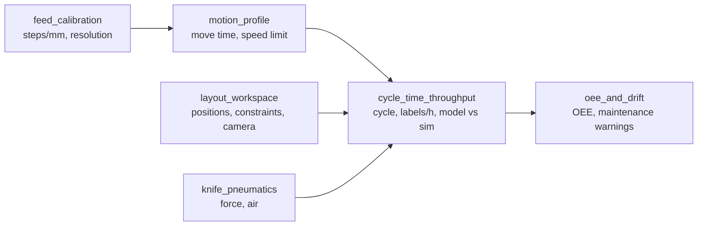
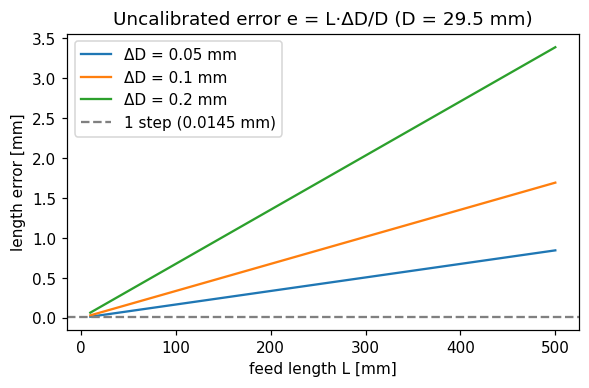
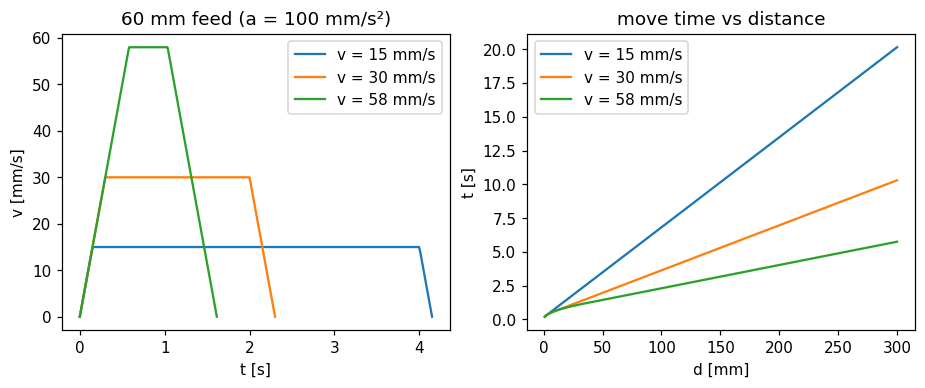
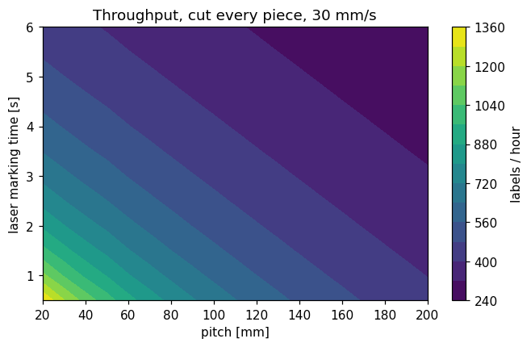
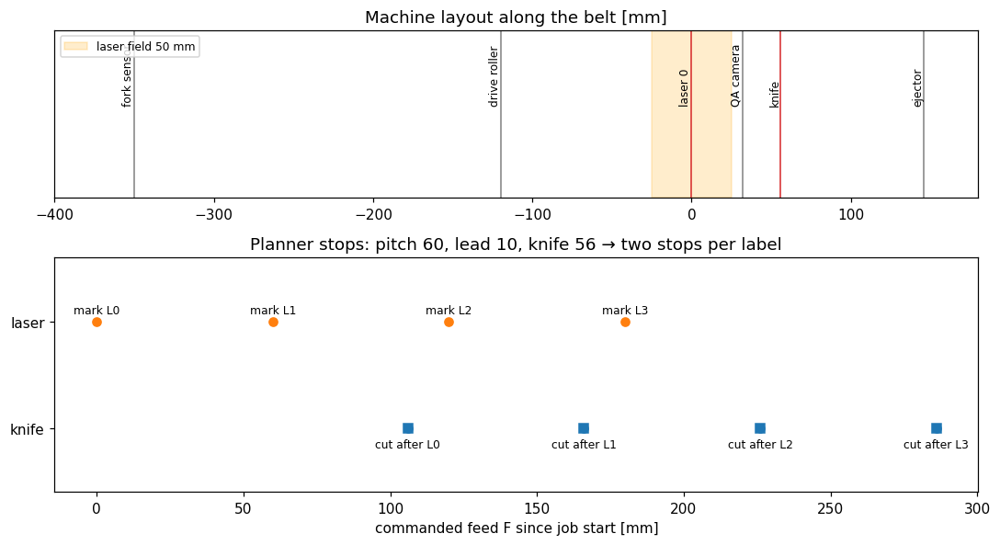
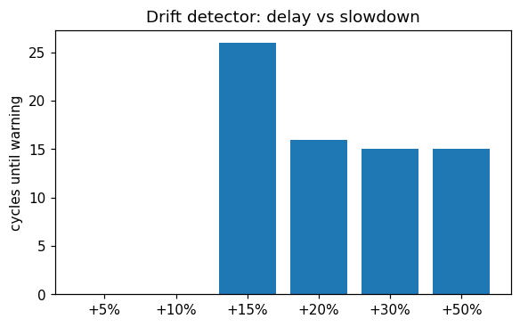

# Engineering analysis

Short, runnable calculations behind the design choices. Each script prints a table and
writes a figure to [`figures/`](figures/). They use the same code as the machine (the
planner, the plant model, the drift detector), so the numbers match the system.

```bash
pip install numpy matplotlib          # no ROS needed
python3 analysis/run_all.py           # all scripts, ~10 s
python3 analysis/cycle_time_throughput.py   # or one by one
```



## 1. Feed scale and resolution: `feed_calibration.py`

$$s = \frac{200\,\mu}{\pi D\, i}\ \ \text{[steps/mm]}, \qquad r = \frac{1}{s}, \qquad s_{new} = s_{old}\,\frac{L_{cmd}}{L_{meas}}$$

μ is the micro-step setting of the DM542, D the drive roller diameter, i the gear ratio.

| Result | Value |
|---|---|
| Resolution at 69 steps/mm (legacy) | 0.0145 mm/step |
| Hardware that gives 69 steps/mm (direct drive) | 1/32 micro-steps with Ø ≈ 29.5 mm roller, or 1/64 with Ø ≈ 59 mm |
| Calibration example: 200 mm commanded, 197 mm measured | 70.05 steps/mm (+1.5 %) |

An error ΔD in the roller diameter gives a length error $e = L\,\Delta D / D$. A 0.1 mm
error on a 29.5 mm roller is 0.2 mm over a 60 mm label, which is why the calibration
wizard exists.



## 2. Motion profile: `motion_profile.py`

Trapezoidal move with acceleration *a* and speed *v* over distance *d*:

$$t = \begin{cases} \dfrac{d}{v} + \dfrac{v}{a} & d \ge v^2/a \\[4pt] 2\sqrt{d/a} & d < v^2/a \end{cases}
\qquad v_{max} = \frac{f_{max}}{s} = \frac{4000}{69} = 58\ \text{mm/s}$$

| d \ v | 15 mm/s | 30 mm/s | 58 mm/s |
|---|---|---|---|
| 60 mm | 4.15 s | 2.30 s | 1.61 s |
| 200 mm | 13.48 s | 6.97 s | 4.03 s |

Above ~30 mm/s, short moves gain little because acceleration dominates.



## 3. Cycle time and throughput: `cycle_time_throughput.py`

With one station and *cut every piece*, a label needs a mark stop and a cut stop:

$$T = t_{move}(p-k) + t_{move}(k) + t_{settle} + t_{laser} + t_{post} + t_{knife}, \qquad k = (x_c - lead) \bmod p$$

$$\text{throughput} = 3600 / T\ \text{[labels/h]}$$

The planner uses this model as the *ideal cycle* for OEE. The script compares it with the
simulation (controller + plant model):

| pitch | laser | cut | model | simulation | diff | labels/h |
|---|---|---|---|---|---|---|
| 30 mm | 0.5 s | every | 2.92 s | 3.00 s | +2.9 % | 1198 |
| 60 mm | 0.5 s | every | 3.91 s | 3.99 s | +2.2 % | 902 |
| 60 mm | 2.0 s | every | 5.41 s | 5.50 s | +1.6 % | 655 |
| 60 mm | 2.0 s | none | 4.24 s | 4.34 s | +2.5 % | 829 |
| 120 mm | 3.0 s | every 5 | 7.59 s | 7.69 s | +1.4 % | 468 |

The 1.4–2.9 % gap comes from the control tick, the laser start latency and polling of
the done signal. It shows up as the OEE *performance* loss. The marking time dominates
throughput: halving it helps more than doubling the feed speed.



## 4. Layout (the machine's workspace): `layout_workspace.py`

The workspace is one-dimensional, along the belt. A belt point with belt coordinate *s*
is at $x = F - s$ after feeding *F*.

| Event | Feed position |
|---|---|
| station *i* marks label *k* | $F = k\,p + x_i$ |
| knife cuts after label *k* | $F = (k+1)\,p - lead + x_c$ |
| camera sees the mark centre | $F = s + x_{cam} - L_{mark}/2$ |

Constraints checked by the job validation:
$lead + L_{mark} \le p$, $L_{mark} \le W_{field}$ (50 mm), and for cut modes $x_i \le x_c - lead$
(a station must mark the label before the knife frees it). A second laser at 150 mm
therefore needs the knife beyond 160 mm; the multi-laser config uses 230 mm.

Camera exposure for at most *b* blur at speed *v*: $t_e \le b / v$, i.e. 3.3 ms for 0.1 mm at 30 mm/s.



## 5. Knife pneumatics: `knife_pneumatics.py`

$$F_{ext} = p\,\frac{\pi D^2}{4}, \qquad F_{ret} = p\,\frac{\pi (D^2 - d^2)}{4}, \qquad
V_{free} = (A_{ext} + A_{ret})\cdot \text{stroke}\cdot \frac{p + p_{atm}}{p_{atm}}$$

Example (the installed cylinder is undocumented; replace with nameplate data):
Ø16/6 mm, 120 mm stroke, 5 bar → 101 N extend, 86 N retract, 0.27 L free air per cut,
2.7 L/min at 600 cuts/h.

## 6. OEE and drift detection: `oee_and_drift.py`

$$OEE = A \cdot P \cdot Q,\quad A = \frac{t_{run}}{t_{run} + t_{down}},\quad
P = \frac{N\, T_{ideal}}{t_{run}},\quad Q = \frac{N_{good}}{N}$$

A 2-hour simulated shift with three faults (scenario 12) gives A = 97.4 %, P = 94.4 %,
Q = 99.96 %, **OEE = 91.9 %**.

Drift detector (robust statistics, insensitive to single outliers):

$$\sigma \approx 1.4826\cdot MAD,\qquad z = \frac{\text{median}(x_{last\,W}) - m_0}{1.253\,\sigma/\sqrt{W}},\qquad
\text{warn if } |z| > 4 \text{ and } |\Delta| > 15\,\%$$

| Knife slowdown | Cycles until W-702 (3 % noise) |
|---|---|
| +5 %, +10 % | not flagged (below the 15 % rule, by design) |
| +15 % | 21–40 |
| +20 % | 16–18 |
| +30 %, +50 % | 15 |


