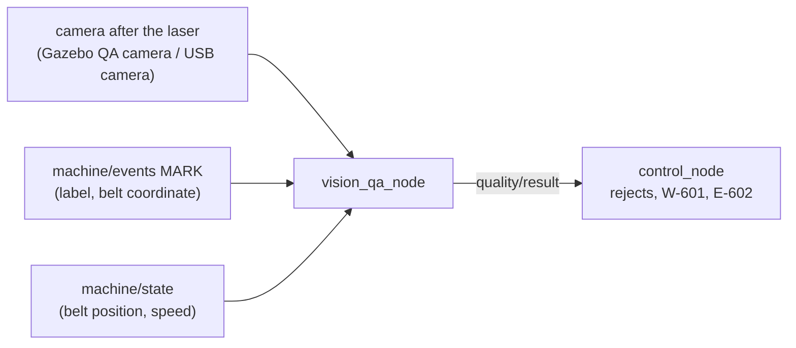
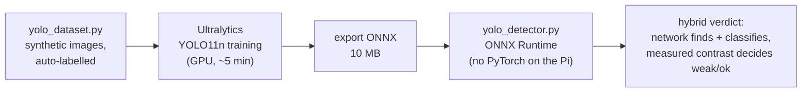
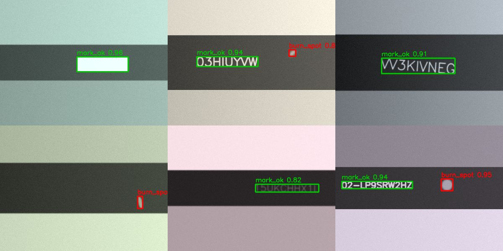

# AI features (optional, never in the safety path)

All modules live in [`belt_marking_vision`](../ros2_ws/src/belt_marking_vision/). They
**observe and suggest**. The machine controller decides, and the hardwired safety chain
is untouched. Each works offline on a Raspberry Pi 4.

| # | Feature | Status | Where the decision is made |
|---|---|---|---|
| 1 | Vision quality check (OpenCV rules or YOLO) | implemented, tested (synthetic + Gazebo camera) | controller counts rejects, HOLD after N in a row (E-602) |
| 2 | Anomaly detection / predictive maintenance | implemented, tested live in simulation | warning only (W-702); maintenance decides |
| 3 | Operator assistant (docs Q&A) | implemented (retrieval, optional local LLM) | the human reads it; it has no machine access |
| 4 | Natural-language job entry | implemented (rule-based, UI button) | the operator checks the form and presses START |

## 1. Vision quality check



* **Frame selection**: for every mark the node predicts when its centre passes the
  camera (`x = feed − s + mark_len/2`) and keeps the frame with the smallest distance.
  Moving belts need a short exposure / LED strobe on real hardware.
* **Checks** (`inspector.py`, OpenCV): presence (area), contrast against the belt
  (dirty lens, low laser power, wrong focus), position along the belt (bounding-box
  centre vs. expected), and optionally **OCR** of the expected text (`mark_text` in the
  job) with Tesseract if installed (`apt install tesseract-ocr && pip install
  pytesseract`). A vision-language model can replace `ocr=` with any callable.
* **Reactions** (controller): each reject counts in the job, the OEE quality and the
  production log. `machine.consecutive_reject_limit` rejects in a row → E-602 HOLD.
* **Modes**: `synthetic:=true` (simulation without Gazebo: the label is rendered from the
  plant's ground truth, so weak/missing marks come from fault injection) or camera mode
  (`image_topic`, `rotate_deg`, `mm_per_px`).
* **Calibration on the machine**: `mm_per_px` from a label of known length; `min_contrast`
  halfway between good marks and deliberately weak marks (reduced laser power).

* `roi_across` limits the analysis to the belt band of the image (without it the bright
  surroundings distort the belt level). `min_contrast` default 115 grey levels.

Verified:
* unit tests on synthetic good / weak / missing / offset labels, and 60 label texts without a false reject;
* simulation without Gazebo (synthetic mode): `laser_weak_mark` → three consecutive
  `low_contrast` rejects → E-602 HOLD;
* **Gazebo QA camera** (camera mode): good marks contrast 150 → OK (offset 0.2–1.7 mm);
  weak marks contrast 87 → rejected, W-601 raised by the controller.

Limitation: in continuous mode the last labels of a job stop between the laser and the
camera and are not inspected. They are inspected when the next job moves them past.
The same applies to a camera placed further downstream.

## 1b. YOLO detector (optional backend)



Classes: `mark_ok`, `mark_weak`, `burn_spot` (scorch defect). No box means a missing mark.

```bash
pip install ultralytics                                   # training machine only
python3 tools/yolo/train_mark_detector.py --out runs/marks   # dataset, train, ONNX, evaluation
ros2 run belt_marking_vision vision_qa_node --ros-args -p detector:=yolo \
    -p yolo_model:=runs/marks/train/weights/best.onnx -p synthetic:=false
```



Runtime on the Pi: `pip install onnxruntime` (ARM64 wheels). OpenCV DNN is the fallback,
but it needs OpenCV ≥ 4.7: the OpenCV 4.5 of Ubuntu 22.04 cannot run the YOLO11 graph
(tested). Both paths were tested with the trained model.

**Results** (YOLO11n, 30 epochs, 2000 training images, RTX 4090):

| Test | Classic OpenCV | YOLO |
|---|---|---|
| Validation set (mAP50 / mAP50-95) | – | 0.993 / 0.955 |
| 500 held-out synthetic images, verdict ok / weak / missing / burn spot | 47.4 % | 98.0 % |
| Gazebo QA camera, good marks | OK (contrast 150) | OK (detected, score 0.98) |
| Gazebo QA camera, weak marks | rejected (contrast 87) | network: "ok"; hybrid check: rejected (contrast 109) → E-602 |

How to read this:
- The synthetic test favours YOLO: it comes from the same generator as the training
  data, and it varies lighting on purpose, which the fixed-threshold classic inspector is
  not designed for. Classic cannot detect burn spots at all.
- In Gazebo the network found and located every mark, but it did **not** transfer the
  weak-vs-ok judgement to a rendering it had never seen (domain gap). Therefore the
  verdict is **hybrid**: YOLO finds the mark and classifies defects, and the measured contrast
  in the box (calibrated threshold, 115 grey levels) decides weak vs ok.
- The 109 vs 115 margin on Gazebo's weak marks is small: calibrate `min_contrast` on the
  real camera with good and deliberately weak marks.
- At 15 fps and 20 mm/s the camera's frame spacing is 1.3 mm; one good mark was rejected
  for offset (2.2 mm > 2 mm). Use a faster camera, a strobe, or a wider offset tolerance.

**For the real machine:** collect 200–500 camera images (the twin and the plant model can
label marks automatically from the process events), fine-tune from this model, and keep
the hybrid contrast check.

## 2. Anomaly detection / predictive maintenance

Every cycle time is logged by the controller (`cycle_times` table: `knife_extend`,
`knife_retract`, `laser`, `feed`). `anomaly_node` reads the DB (read-only) and uses a
**robust drift detector**: the baseline is the median/MAD of the first N samples. The
rolling median of the last W samples must exceed a robust z-score **and** a relative
change (default 15 %) before `maintenance/drift` → **W-702** is raised. The message
names the component, e.g.

```
W-702 Cycle time drift detected knife_extend: 380 ms vs baseline 308 ms (+23 %, slower, z=112.6)
```

(recorded in the simulation after slowing the knife: `ros2 param set /sim_hardware_node knife_stroke_time_s 0.45`).

What it catches before failure: worn cylinder seals, dropping air pressure or a clogged
flow control (knife slower), a laser optics/power problem (longer busy time), and belt
drag or a failing motor (feed time). `MultivariateDetector` watches all signals together
and names the drifting one.

*Isolation Forest* was evaluated and **not used**. Points outside the training range
score like the most extreme training points, so a +50 % knife slowdown was flagged in
only ~10 % of windows. The robust z-score flags > 90 % of windows at +20 %. For richer
data (vibration, current), a novelty detector such as LOF (`novelty=True`) is the next
step.

Blade life: counter `knife.blade_life_cycles` → W-701, reset in Calibration.

## 3. Operator assistant (read-only)

```bash
ros2 run belt_marking_vision assistant "what does E-401 mean?"
ros2 run belt_marking_vision assistant "how is the relay wired to the laser pedal?"
```

* Alarm codes are answered **exactly** from the alarm catalogue (text, reaction, remedy).
* Other questions: BM25 retrieval over the Markdown sections of `docs/` (installed with
  the package), which returns the best sections and their sources.
* Optional local LLM: `export BELT_ASSISTANT_LLM_URL=http://localhost:11434` (Ollama,
  `BELT_ASSISTANT_MODEL=llama3.2` or similar). The model only rewrites the retrieved
  sections; the prompt forbids operating the machine.
* **Read-only by construction**: the module has no ROS publishers or clients. It cannot
  command the machine.

## 4. Natural-language job entry

Job setup → **Describe job…** → e.g. *"200 pieces of 30 mm belt, cut each, width 20 mm"*
→ the form is filled (quantity 200, pitch 30, cut every piece, width 20) and the
recognised fields are listed. Nothing starts: the operator checks, then presses START
and confirms, which is the normal path. The parser is rule-based (English + some
Turkish: *adet, parti sonu, kesmeden*), deterministic and offline. An LLM could be added
behind the same function, still producing only a draft.
