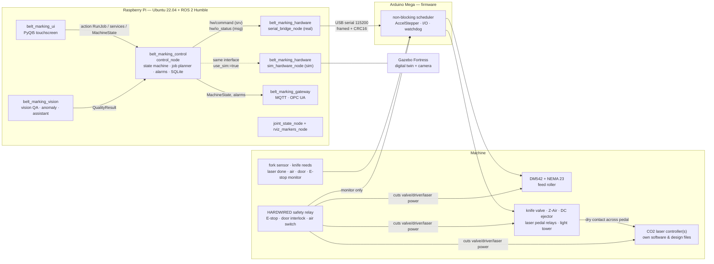
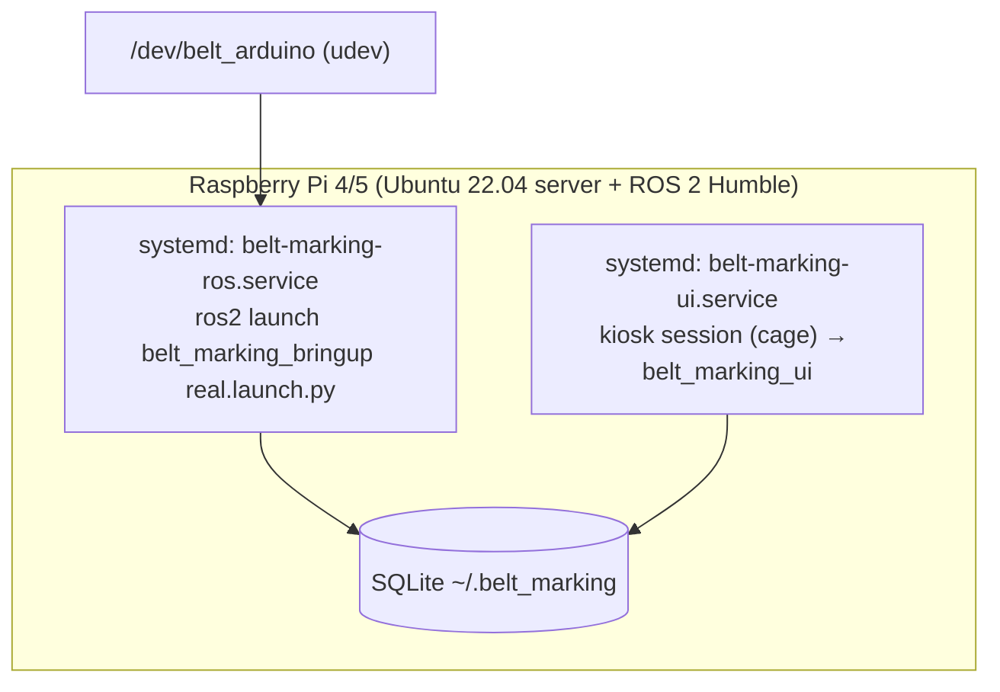

# Architecture

## 1. Overview

The design has three layers. Only the lowest one differs between simulation and real
operation:

| Layer | Runs on | Sim | Real |
|---|---|---|---|
| Operator UI, gateway, vision, visualisation | Pi | identical | identical |
| Machine control (state machine, job planner, alarms, DB) | Pi | identical | identical |
| Hardware layer (`hw/command` + `hw/io_status`) | Pi (+ Mega) | `sim_hardware_node` (plant model, optionally mirrored to Gazebo) | `serial_bridge_node` ↔ Arduino firmware |

## 2. Key decisions

### D1. Arduino Mega + custom framed serial protocol (no micro-ROS)
micro-ROS does not support the ATmega2560, which has 8 KB of RAM and no RTOS.
The Mega is already installed, wired and cheap to replace. It stays as the
real-time I/O controller and speaks a small binary protocol
([SERIAL_PROTOCOL.md](SERIAL_PROTOCOL.md)):
`AA 55 | len | seq | id | payload | CRC16`, with ACK/NAK, retransmission,
50 Hz status and a 100 ms heartbeat. The firmware runs its own watchdog. If it hears
nothing from the Pi for 500 ms, it stops the motor, retracts the knife and
inhibits the laser triggers.
*Upgrade path:* Teensy 4.1 or ESP32 with micro-ROS, publishing `IoStatus`
directly. Only `serial_bridge_node` would be replaced.

### D2. Sim and real share one ROS interface
`control_node` talks to "the hardware" through exactly one service and one
topic:

- `hw/command` (`belt_marking_interfaces/srv/HwCommand`): move, stop, set/pulse
  output, enable, zero, reset faults.
- `hw/io_status` (`belt_marking_interfaces/msg/IoStatus`, 50 Hz): every input,
  every output, position, speed, motion id, link and fault flags.

`serial_bridge_node` and `sim_hardware_node` both implement this contract. The
launch argument `use_sim:=true|false` picks one of them. Nothing above this
layer knows which one is running. The laser is also handled at this
level: in sim, the plant model contains a simulated CO2 laser controller that
answers the same "pedal" pulse with the same busy/done signal.

### D3. Pure-Python core, thin ROS wrappers
State machine, job planner, alarm handling, OEE and the database are plain
Python (`belt_marking_control.core`) behind a small `HardwareInterface`
abstraction. This means:
- unit and scenario tests run in milliseconds with a simulated clock (no DDS),
  so 12 industrial scenarios, including an 8-hour soak, run in CI;
- `control_node` is a thin adapter that maps ROS topics/services/actions
  onto the core.

### D4. Gazebo Fortress via `ros_gz` as a kinematic digital twin
Gazebo Fortress (Ignition Gazebo 6) is the officially paired version for
Humble. Gazebo Classic is end-of-life. Gazebo has no deformable belt, and
friction-driven conveyors (the TrackController system) are not repeatable to
0.1 mm. The belt is therefore **kinematic**:

- the belt position comes from the stepper model in `sim_hardware_node`, the
  same way the real machine is open-loop on steps;
- `gz_twin_node` mirrors it into Gazebo: laser marks are spawned as thin decal
  models and moved with the belt (`SetEntityPose`). When the knife cycles, the
  cut piece, with its marks, is spawned as a dynamic body that falls into
  the output bin. Knife and laser head are URDF joints driven by
  `JointPositionController` systems;
- a camera sensor after the laser feeds the vision QA node.

Trade-off: Gazebo contact physics are not used for transport. Belt slip is
simulated by fault injection in the plant model instead. The whole control stack
runs without Gazebo (`gazebo:=false`), which is how CI works.

### D5. Safety is hardware first
E-stop, the laser-enclosure door interlock and the air-pressure switch act on a
**hardwired safety relay**. That relay removes power from the valve manifold,
the DM542 and the laser controller's enable/interlock input. Software, both
firmware and Pi, only **monitors** these signals and reacts (ABORT, alarm,
light tower). No software function in this repository is a safety function,
and none claims any safety rating. See [ELECTRICAL.md](ELECTRICAL.md) §3.

### D6. Laser integration: the pedal relay
The laser controller keeps its own design files and software. We only emulate
the foot pedal:
- **Trigger:** a relay contact (dry, isolated) wired in parallel with the pedal.
  It closes for a configurable pulse (default 200 ms, range 50–1000 ms).
  No voltage is ever injected into the laser controller.
- **Completion:** `laser.done_mode: signal` uses the controller's "work
  done/busy" output, wired through an optocoupler to a Mega input (many
  Ruida-type controllers provide one; see ASSUMPTIONS). `laser.done_mode: timed`
  waits a configured per-job marking time. Both modes have a timeout alarm.
- The abstraction `LaserInterface` (`trigger()`, `is_busy()`, `poll_done()`,
  `wait_done(timeout)`) hides this, so a fiber laser or a laser with an
  Ethernet/RS-232 API can be dropped in later.

### D7. Operator UI: PyQt5 + rclpy
Options considered: PyQt5, a web UI (FastAPI + Chromium kiosk), and Flutter.
PyQt5 was chosen because:
- it is an apt package on Ubuntu 22.04 (`python3-pyqt5`) that matches Humble's
  Python 3.10, with no extra runtime or browser (about 150 MB less RAM than Chromium
  on a Pi 4);
- it lives in-process with rclpy, so there is no second API layer to secure;
- 800×480 touch works well with a custom QSS (≥ 64 px touch targets).
Remote dashboards are covered by the MQTT/OPC UA gateway instead.

### D8. Persistence: SQLite
Recipes, jobs, the production log, alarm history, users and the audit trail
live in one SQLite file (`~/.belt_marking/belt_marking.db`, WAL mode).
`control_node` is the writer for production data. The UI (same host) reads
history and statistics directly and writes only its own users/audit tables.
CSV export is done by the UI and `tools/export_logs.py`.

### D9. `ros2_control`?
It was evaluated and **not used** for the conveyor. The machine has one
open-loop axis whose position loop runs on the Mega (AccelStepper). It
behaves as an indexing drive, not a trajectory-following joint. A
`ros2_control` SystemInterface would add a C++ plugin and a controller manager,
but provide no controller we need. It becomes worth it if the axis gets an
encoder and closed-loop velocity control, e.g. with a Teensy/EtherCAT
upgrade.

## 3. Packages

| Package | Type | Content |
|---|---|---|
| `belt_marking_interfaces` | ament_cmake | msg / srv / action definitions |
| `belt_marking_laser` | ament_python | `LaserInterface`, `DryContactLaser`, `SimulatedCo2Laser` device model |
| `belt_marking_hardware` | ament_python | `HardwareInterface`, protocol codec, `FakePlant`, `serial_bridge_node` (lifecycle), `sim_hardware_node` |
| `belt_marking_control` | ament_python | core (state machine, planner, sequencer, alarms, DB, OEE), `control_node`, `rviz_markers_node` |
| `belt_marking_description` | ament_python | xacro/URDF, RViz config, `joint_state_node` |
| `belt_marking_gazebo` | ament_python | world, bridge config, `gz_twin_node` |
| `belt_marking_ui` | ament_python | touchscreen UI |
| `belt_marking_gateway` | ament_python | MQTT + OPC UA (optional dependencies) |
| `belt_marking_vision` | ament_python | vision QA, anomaly detection, docs assistant, NL job entry |
| `belt_marking_bringup` | ament_python | launch files, YAML config, launch tests |

Dependency direction (no cycles):
`interfaces ← laser ← hardware ← control ← {ui, gateway, vision, description, gazebo} ← bringup`

## 4. Topics, services, actions

| Name | Type | Provider → consumer |
|---|---|---|
| `hw/io_status` | `IoStatus` | hardware → control, viz, UI (I/O screen) |
| `hw/command` | `HwCommand` (srv) | control → hardware |
| `machine/state` | `MachineState` (10 Hz, reliable, transient-local) | control → UI, gateway, viz, vision |
| `machine/alarms` | `Alarm` (every raise/clear/ack event) | control → UI, gateway |
| `machine/events` | `ProcessEvent` (mark / cut / reject / piece out) | control → viz, vision, twin |
| `machine/run_job` | `RunJob` (action) | UI/gateway → control |
| `machine/command` | `MachineCommand` (reset, hold, unhold, stop, abort, clear) | UI/gateway → control |
| `machine/set_mode` | `SetMode` | UI → control |
| `machine/jog`, `machine/home`, `machine/cut_now`, `machine/trigger_laser`, `machine/set_output` | manual services | UI → control |
| `machine/ack_alarm` | `AckAlarm` | UI → control |
| `recipes/load`, `recipes/save`, `recipes/list`, `recipes/delete` | recipe services | UI → control |
| `quality/result` | `QualityResult` | vision → control |
| `sim/inject_fault` | `InjectFault` (sim only) | tests/UI → sim hardware |
| `joint_states` | `sensor_msgs/JointState` | joint_state_node → robot_state_publisher, twin |
| `machine/markers` | `visualization_msgs/MarkerArray` | rviz_markers_node → RViz |

## 5. Job planner (belt coordinates)

The legacy code mixed forward and reverse moves. The new planner is
**forward-only** and works in belt coordinates:

- `F` is the commanded feed, in mm since job start.
- The mark origin of label `k` sits at belt coordinate `s_k = k·p`, where `p` is the pitch.
- Station `i` sits `x_i` mm downstream of station 0, so it marks label
  `k` when `F = k·p + x_i`. Station 0 is at `x_0 = 0`.
- The knife sits `x_c` mm downstream of station 0. The cut after label `k` is at
  `s = (k+1)·p − lead`, where `lead` is the distance from the label's leading edge to its mark origin.
  That cut happens at `F = (k+1)·p − lead + x_c`.
- Which cuts exist depends on the cut mode: `none`, `every`, `every_n`, `end`.

All events are sorted by `F` and merged when they are within 0.01 mm into
**stops**. Each stop runs: move → settle → trigger lasers (per-station delay)
→ wait done → post-mark delay → cut (extend → sensor → retract → sensor →
eject). When the station offsets and knife offset are multiples of the pitch,
there is exactly one stop per pitch. Otherwise the planner inserts extra stops
automatically. See [STATE_MACHINE.md](STATE_MACHINE.md) for the sequence
diagram.

## 6. Deployment

Details: [IMPLEMENTATION_GUIDE.md](IMPLEMENTATION_GUIDE.md) and
[`raspberry_pi/`](../raspberry_pi/README.md).
