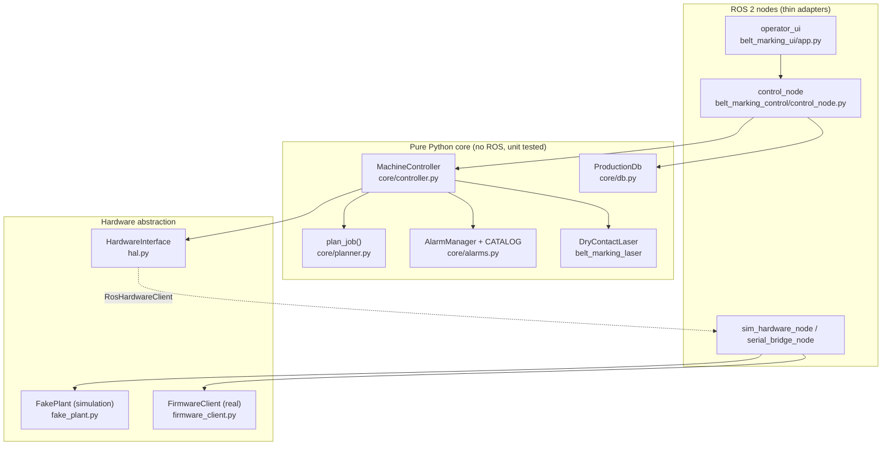
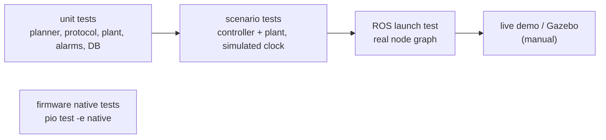

# Code guide

How the code is organised, how a job travels through it, and how to extend it.

## 1. Layers

Rule of thumb: **logic lives in the core and is tested without ROS; nodes only translate
between ROS messages and core calls.** Simulation and real hardware differ only below
`HardwareInterface`.

## 2. A job, step by step

| Step | Code |
|---|---|
| Operator presses START | `screens/job.py: JobScreen.request_start()` → validates with `core/job.py: validate()` → `RosBridge.run_job()` |
| Action arrives | `control_node.py: ControlNode._execute_job()` → `MachineController.cmd_start(job)` |
| Plan is made | `core/planner.py: plan_job()` → list of `Stop(feed_mm, fires, cut)` |
| Control loop (100 Hz) | `MachineController.tick(now)` → `_monitor()` (alarms from inputs) → `_st_<state>()` |
| Executing a stop | `_ph_feed` → `_ph_settle` → `_ph_laser` → `_ph_post_delay` → `_ph_cut_extend/dwell/retract` → `_ph_next` |
| Moving the belt | `hal.move_relative()` → `hw/command` → firmware `MOVE_REL` (or `FakePlant.cmd_move_rel`) |
| Triggering the laser | `DryContactLaser.trigger()` → `pulse_output('laser_0', 200 ms)`; completion in `poll_done()` |
| A fault | input changes → `_monitor()` → `AlarmManager` → `_on_alarm()` applies the reaction (HOLD/ABORT) |
| Results | `on_event` / `on_job_end` callbacks → `ProcessEvent` topic + SQLite (`core/db.py`) |

## 3. Key files

| File | Read it for |
|---|---|
| `belt_marking_control/core/controller.py` | the state machine and the per-stop sequence (one `_st_*` method per state, one `_ph_*` per phase) |
| `belt_marking_control/core/planner.py` | turning a job into belt positions (≈ 120 lines) |
| `belt_marking_control/core/alarms.py` | every alarm: code, severity, reaction, remedy |
| `belt_marking_hardware/fake_plant.py` | the simulated machine and firmware rules |
| `belt_marking_hardware/protocol.py` + `firmware/arduino_mega/lib/protocol/` | the serial frame format, both sides |
| `firmware/arduino_mega/src/main.cpp` | the non-blocking firmware loop |
| `belt_marking_control/scenarios.py` | the 12 scenarios, readable as specifications |

## 4. Extending

**Add an alarm.** Add an `AlarmDef` to `CATALOG` in `core/alarms.py` (code, severity,
reaction, text, remedy). Raise it in `controller.py` with `self._event_alarm(code)`
(an edge, e.g. a timeout) or `self.alarms.condition(code, present, now)` (a level, e.g.
a sensor). The UI, the database and the docs assistant read the catalogue; add the new
row to the alarm table in OPERATOR_MANUAL.md and STATE_MACHINE.md.

**Add a laser type** (e.g. Ethernet API). Implement `LaserInterface` (`trigger`,
`is_busy`, `poll_done`) in `belt_marking_laser`, and create it in `cmd_start()` instead of
`DryContactLaser`. Nothing else changes.

**Add a sensor or output.** Firmware: `pins.h` + bit in `io_logic.h`. Python:
`hal.py` (`INPUT_NAMES` / `OUTPUT_NAMES`), `IoStatus.msg`, `ros_conv.py`, and the plant
model if it should be simulated.

**Add a scenario.** Write `sNN_name(r)` in `scenarios.py` with `Harness` (controller +
plant on a simulated clock) and `r.check(...)`, add it to `SCENARIOS`, and add a live
version in `demo.py`.

**Add a job parameter.** `JobSpec.msg` → `core/job.py: Job` (+ `validate`, `job_from_msg`,
`job_to_msg`) → use it in `planner.py` or `controller.py` → a field in `screens/job.py`.

## 5. Conventions

- Units in names: `_mm`, `_s`, `_ms`, `_mm_s`. Positions in mm along the belt.
- Every tunable value is in `config/machine.yaml` and in a dataclass in `core/config.py`
  (a test checks that the two match). Values to be measured on the machine are marked
  `# TODO: verify on hardware`.
- The controller never blocks: it is ticked with `now` and uses timestamps, so the same
  code runs in real time and in accelerated tests.
- Style: `ament_flake8` (max line 99) for Python, `clang-format` (Google) for C++.

## 6. Tests

`colcon test` runs everything except the firmware tests and Gazebo. CI runs both on
every push (`.github/workflows/ci.yml`).
