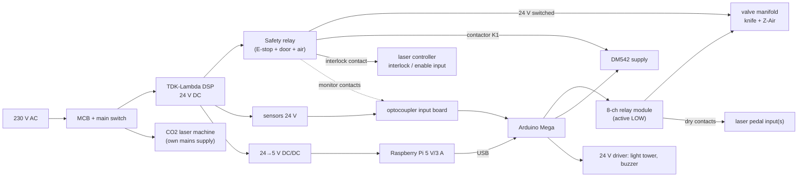
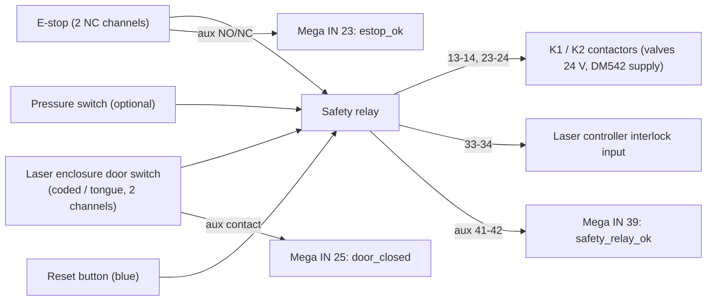

# Electrical design

> ⚠️ **Safety notice.** This document describes the intended design. It is guidance, not a
> certified safety design. A qualified electrician must design, build and verify the
> safety circuit against the machine's risk assessment (ISO 12100) and IEC 60204-1 /
> ISO 13849-1. Class 4 laser: IEC 60825-1. Nothing in the software is a safety function.

## 1. Overview



## 2. Power

| Rail | Source | Consumers | Notes |
|---|---|---|---|
| 24 V DC | TDK-Lambda DSP (existing) | sensors, valve coils, light tower, relay contacts side | model/rating not recorded (A-34). Check the load: valves ≈ 2–5 W each |
| 24 V safe | safety relay outputs | valve manifold, DM542 contactor | dropped by E-stop / door / air |
| Motor supply | DM542: 24–48 V DC (datasheet range) | NEMA 23 | a separate 36–48 V supply gives better torque at speed; TODO: record the existing supply |
| 5 V logic | Mega via USB from the Pi, or a 7–12 V DC jack | Mega, relay module coils (via the Mega's 5 V) | 8 relays × ~70 mA: power the relay module from a separate 5 V (remove the JD-VCC jumper) |
| Pi | 5 V / 3 A (Pi 4) or 5 V / 5 A (Pi 5) DC/DC from 24 V | Pi + touchscreen | the official display is powered from the Pi |

Grounding: one star point for 0 V at the PSU. PE bonds the machine frame, laser machine,
cabinet and door. Use a shielded cable for the stepper motor with the shield on PE at the
driver end. Route motor and valve cables apart from sensor/USB cables.

## 3. Safety chain (hardwired)



* The E-stop removes the energy (stop category 0 or 1, per the risk assessment) from the
  valves and the stepper supply **independently of the software**, and inhibits the laser
  through the laser controller's own interlock input (Ruida-type controllers have
  *protect/interlock* inputs; TODO: identify them on the installed controller).
* **Air.** When the valve power drops, a bistable 5/2 knife valve **keeps its position**.
  To make the knife safe on E-stop, add a safety dump / soft-start valve that exhausts
  the system ([PNEUMATICS.md](PNEUMATICS.md)).
* The laser enclosure door interlock must inhibit the laser beam (IEC 60825-1 class 4).
  Many laser machines already have a lid switch: keep it, and wire it into the chain.
* Reset is manual (a separate button on the safety relay). The software's RESET/CLEAR is
  only a request on top of that.
* The Mega and the Pi **read** monitor contacts only (E-101, E-102, E-103 alarms, ABORT
  reaction, UI messages).

Suitable safety relays: any 2-channel E-stop/guard relay with monitored manual reset (for
example Pilz PNOZ s-series, Phoenix PSR, Schneider XPS). Choose the category/PL from the
risk assessment.

## 4. Pin map (Arduino Mega 2560)

Source of truth: [`firmware/arduino_mega/include/pins.h`](../firmware/arduino_mega/include/pins.h).
Legacy (2019) pins are kept.

| Pin | Signal | Dir | Electrical | Notes |
|---|---|---|---|---|
| 48 | STEP → DM542 PUL | out | 5 V | legacy |
| 50 | DIR → DM542 DIR | out | 5 V | legacy, HIGH = forward |
| 52 | ENA → DM542 ENA | out | 5 V | legacy, LOW = enabled |
| 11 | fork sensor (belt present) | in | 24 V PNP → opto | legacy, active LOW after the interface |
| 7 | knife extended reed | in | 24 V → opto | legacy `r_ls` (TODO: verify side) |
| 5 | knife retracted reed | in | 24 V → opto | legacy `l_rs` |
| 9 | knife start sensor | in | 24 V → opto | legacy `ps_s` |
| 23 | E-stop monitor | in | aux contact → opto | new |
| 25 | door closed monitor | in | aux contact → opto | new |
| 27 | air pressure OK | in | pressure switch → opto | new, optional |
| 29, 31, 33, 35 | laser 0–3 busy | in | laser output → opto | new, optional (`laser.done_mode: signal`) |
| 37 | DM542 ALM | in | driver opto output | new |
| 39 | safety relay OK | in | aux contact → opto | new |
| 41 | home sensor | in | optional | |
| 2, 3 | encoder A/B | in | 5 V / 24 V via opto | optional (belt slip detection) |
| 42 | knife EXTEND solenoid | out | relay 1 (active LOW) | legacy `rl_r` |
| 40 | knife RETRACT solenoid | out | relay 2 | legacy `lr_r` |
| 44 | Z-Air valve | out | relay 3 | legacy `mlr_r` |
| 46 | DC motor (ejector) | out | relay 4 | legacy `dcm_r` |
| 38 | laser 0 pedal contact | out | relay 5 (dry contact) | legacy `lasersignal` |
| 36, 34, 32 | laser 1–3 pedal contact | out | relays 6–8 (dry contacts) | new |
| 22, 24, 26, 28 | light red/yellow/green, buzzer | out | 24 V transistor module (active HIGH) | new |

## 5. Laser pedal relay (dry contact), the key integration

```
 Laser controller                    Belt marking cabinet
 ┌──────────────────┐
 │  FOOT SW  IN ────┼────┬─────────────── pedal (NO) ────┐
 │  FOOT SW  COM ───┼────┼──────────────────────────────┘│
 └──────────────────┘    │   relay 5 contact  (COM ─ NO) │
                         └──────────── COM    NO ─────────┘
```

* Wire the relay **COM and NO in parallel with the pedal contact**, nothing else. There is
  **no common ground** between our system and the laser controller, and **no voltage is
  applied** to the pedal input: the contact only closes it, like the pedal.
* The pedal input usually carries a few mA at 5–24 V. General-purpose relay contacts
  can become unreliable at such *dry-circuit* levels over time. For long-term reliability
  use a signal relay with gold-plated contacts, or a PhotoMOS SSR (e.g. AQY21x series),
  which is also dry and isolated.
* Pulse length: `laser.pulse_ms` (default 200 ms, `TODO: verify` that the controller
  detects it; some need ≥ 50 ms, some start on release).
* Set the laser controller to *foot switch / external start* and keep its own design file
  loaded. Our system never generates laser paths.
* Several laser machines: one relay per machine (outputs laser_0..3), each wired only to
  its own pedal input.

### Laser done / busy signal (optional, recommended)

Many controllers (e.g. Ruida RDC-series) provide a *work status / busy* output
(open-collector or 24 V). Wire it through an **optocoupler input** (PC817-type module) to
pins 29/31/33/35, and set `laser.done_mode: signal`. Without it use `timed` and enter the
marking time per job (the laser software shows it). TODO: identify the output terminal
and its polarity on the installed controller (A-43/A-44).

## 6. Sensor interface

24 V PNP sensors → optocoupler board (e.g. 8-channel PC817 24 V→5 V) → Mega inputs. The
firmware corrects polarity (`DEFAULT_INPUT_INVERT_MASK`, or at runtime `SET_CONFIG`) and
debounces (5 ms). The undocumented legacy PCB (A-32) should be replaced or documented
(see `hardware/README.md`).

## 7. DM542 setup

* Wiring: legacy firmware drove ENA LOW = enabled, which suggests common-anode wiring
  (PUL+/DIR+/ENA+ to +5 V, the Mega sinks). Verify, and adjust `STEPPER_ENABLE_ACTIVE_LOW` and
  `setPinsInverted` in `config.h`/`main.cpp` if it differs.
* DIP switches SW1–SW3: current, set to the motor nameplate rating per the DM542 table.
  SW4: standstill half current (ON recommended). SW5–SW8: microstep.
  **TODO: record the installed settings.** The feed scale follows
  `steps/mm = (200 × microsteps) / (π × roller diameter × gear ratio)`. The legacy value
  69 steps/mm must be confirmed with the calibration wizard.
* ALM output → optocoupler → pin 37 (E-403).

## 8. Cable labelling

Label both ends with the pin/terminal names used in this document (e.g. `X2:5 IN39
SAFETY_OK`). Keep the as-built terminal plan in `hardware/` (TODO at commissioning).
