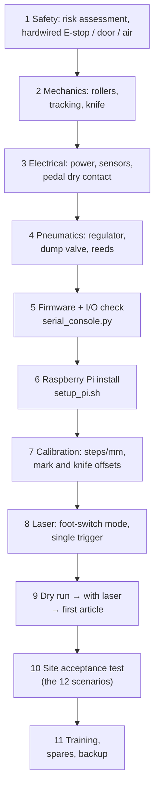

# Real-world implementation guide (commissioning)

Work through the steps in order. Each step ends with a checklist. Record measured values
in `/etc/belt_marking/site.yaml` (overlay) and tick the items in
[ASSUMPTIONS.md](ASSUMPTIONS.md).

> ⚠️ Class 4 laser, pneumatic knife, moving belt. Only qualified personnel. The standards
> named below are **guidance for your own risk assessment, not a certification** of this
> design.



## 1. Safety first

Risk assessment according to **ISO 12100**. Typical hazards and measures:

| Hazard | Measure |
|---|---|
| Laser radiation (class 4 CO2, invisible 10.6 µm), fire | closed enclosure, interlocked door (IEC 60825-1), CO2-rated viewing window, fume extraction interlock, fire extinguisher (CO2), warning labels |
| Fumes from marking belts (PU, PVC → toxic) | extraction with filter, running before the laser can fire (interlock the extraction status into the laser enable if possible) |
| Knife: cutting/crushing | guard around the knife station, dump valve on E-stop, lockable air shut-off |
| Belt feed: drawing-in at the rollers | fixed guards at the nip points |
| Electrical | IEC 60204-1: PE bonding, protected cabinet, labelled main switch |

The functional safety of the E-stop and door circuits follows **ISO 13849-1**
(determine the PLr per function). The Pi and Arduino are **not** part of any safety
function.

- [ ] Risk assessment written and signed
- [ ] E-stop stops belt, knife (air dumped) and laser, **independently of software**
- [ ] Door open → laser cannot fire (tested with the laser armed and a test pattern)
- [ ] Fume extraction running and interlocked (or procedural)
- [ ] Guards on knife and nip points installed

## 2. Mechanical build / refurbishment

- [ ] Rollers run true; bearings smooth; pinch roller pressure even across the width
- [ ] Belt tracking: run the belt 5 m by jog, lateral drift < 0.5 mm, guides set to belt width + 0.5 mm
- [ ] Knife runs free over the full stroke, blade square to the belt
- [ ] Laser marking field centred on the belt; distance to the belt at the laser focus
- [ ] Measure and record: station 0 → knife distance, fork sensor → station 0, roller Ø

## 3. Electrical

See [ELECTRICAL.md](ELECTRICAL.md).

- [ ] 24 V PSU load checked; 0 V star point; PE continuity measured
- [ ] Sensors (24 V PNP) through the optocoupler board to the Mega. Polarity table filled in
- [ ] DM542: supply voltage, DIP switches (current, microsteps) recorded; ALM wired to pin 37
- [ ] **Pedal relay: dry contact in parallel with the pedal. Measure with the relay open:
      no voltage between our 0 V and the laser pedal terminals**
- [ ] Laser busy/done output identified and wired through an optocoupler (or decide on `timed`)
- [ ] Safety relay monitor contacts to pins 23/25/39
- [ ] Cables labelled; motor cable shielded and separated from signal cables

## 4. Pneumatics

See [PNEUMATICS.md](PNEUMATICS.md).

- [ ] Filter-regulator, dump valve, lockable shut-off installed; pressure set and recorded
- [ ] Knife reeds adjusted (both LEDs switch at the end positions, never both on)
- [ ] Flow controls set, stroke time 0.2–0.4 s
- [ ] Pressure switch trips at the set point

## 5. Firmware flashing and I/O check

```bash
cd firmware/arduino_mega
pio test -e native                                    # logic tests on the PC
pio run -e megaatmega2560 -t upload --upload-port /dev/ttyACM0
python3 ../../tools/serial_console.py /dev/ttyACM0    # interactive I/O check
```

In the console: `status`, then operate each sensor by hand and watch its bit. Then
`enable 1`, `move 10`, `out knife_extend 1` / `out knife_retract 1`, `pulse laser_0 200`
(laser **disarmed**/key off first), `out light_green 1`.

- [ ] Every input changes state in `status`; polarity mask adjusted in `config.h` if needed
- [ ] Belt moves forward for positive distances. Otherwise swap DIR (`DIR_FORWARD_LEVEL_HIGH`)
- [ ] Knife interlock: `move` refused while the knife is extended (NAK interlock)
- [ ] Watchdog: quit the console during a long move. The belt stops within 0.5 s, the knife retracts
- [ ] E-stop pressed: firmware reports fault 0x02; motion refused

## 6. Raspberry Pi install and auto-start

See [`raspberry_pi/README.md`](../raspberry_pi/README.md).

```bash
sudo ./raspberry_pi/setup_pi.sh && sudo reboot
```

- [ ] `/dev/belt_arduino` exists; `belt-marking-ros` and `belt-marking-ui` active after boot
- [ ] UI shows STOPPED, no E-501; I/O visible in Calibration → sensor check
- [ ] Default PINs changed (Settings → users, admin)

## 7. Calibration

1. **steps/mm.** Calibration → steps/mm wizard: feed 200 mm, mark the belt at a fixed
   reference before and after, measure with a steel rule or calliper, enter the value →
   saved to `~/.belt_marking/calibration.yaml`. Repeat until the error is < 0.1 %.
2. **Mark position offset.** Run a 3-label continuous job and measure where each mark
   lies relative to the label edge. Adjust `lead_mm` in the recipe, or the design position in
   the laser software.
3. **Knife offset.** Run a 3-piece cut job and measure the piece lengths and the
   cut-to-mark distance. Correct `machine.knife_offset_mm` in `site.yaml` by the error.
4. **Laser done / timing.** Calibration → laser test (wait done): note the busy time. In
   signal mode, check that `ack_timeout_s` (1 s) covers the controller's start latency.
   In timed mode, use the measured time + 10 %.
5. Knife timing test ×10: record extend/retract times (baseline for W-702).

- [ ] steps/mm, knife offset, lead, laser mode and times recorded in site.yaml / recipes

## 8. Laser machine setup

- [ ] Marking design prepared **on the laser controller** (text, logo, power/speed for the belt material)
- [ ] Start mode = foot switch / external start; the job is loaded and stays loaded
- [ ] Single trigger test: Manual → trigger laser once. Exactly one mark, busy time as expected
- [ ] Multi-station: repeat per station. Offsets/delays set in `laser.*`

## 9. Dry run → run with laser → first article

1. **Dry run** (laser key off / door open blocks the laser): run a job in AUTO. Belt
   motion, knife cycles and counters must be correct. Expect E-203 in signal mode (the
   laser does not answer); use `timed` for the dry run.
2. **With laser**: 10-label job at low speed.
3. **First-article inspection**: label length, mark position, cut quality, readability.
   Keep the first article with the job record.

- [ ] First article approved and signed

## 10. Site acceptance test (SAT)

Repeat the simulation scenarios of [SCENARIOS.md](SCENARIOS.md) on the machine:

| # | Test | Physical provocation | Pass criterion |
|---|---|---|---|
| 1 | continuous 50 marks | – | 50 marks, pitch error < ± 0.3 mm |
| 2 | 100 pieces, cut each | – | 100 pieces, length error < ± 0.3 mm |
| 3 | cut every 5 | – | sets of 5 |
| 4 | two stations (if installed) | – | both marks on every label |
| 5 | recipe switch | change the belt | correct width, guides adjusted |
| 6 | laser timeout | disconnect the busy wire (signal mode) | E-201/E-203, HELD, resume works |
| 7 | knife fault | close a flow control | E-301, knife retracted, resume works |
| 8 | belt run-out | run to the end of a roll | E-401, count preserved |
| 9 | link lost | unplug USB during a move | stop < 0.5 s, E-501 |
| 10 | E-stop during cut | press the E-stop | everything stops; CLEAR/RESET procedure works |
| 11 | vision (if installed) | defocus / reduce power | rejects counted, HOLD after N |
| 12 | 8 h production | – | OEE report exported |

- [ ] SAT protocol signed by owner and commissioning engineer

## 11. Training, maintenance, spares

- [ ] Operators trained with [OPERATOR_MANUAL.md](OPERATOR_MANUAL.md) (start, hold, alarms, recipes)
- [ ] Technicians trained on manual mode, calibration and [MAINTENANCE.md](MAINTENANCE.md)
- [ ] Spare parts on site (MAINTENANCE.md §3)
- [ ] First backup (`belt-backup`) stored off the machine
