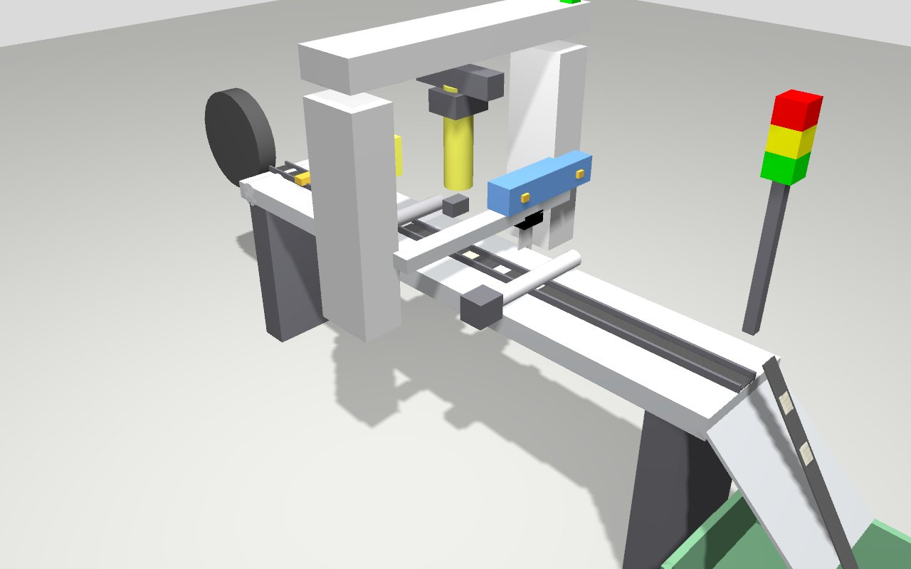

# Mechanical design, BOM

## 1. Machine layout

Along the belt path (x = direction of travel, 0 = mark origin of laser station 0):

| Position | Element | Source |
|---|---|---|
| −0.57 m | supply reel | video |
| −0.42 m | entry idler roller | estimate |
| −0.35 m | Di-Soric fork light sensor (belt present) | `machine.fork_sensor_offset_mm` = 350 (A, verify) |
| −0.12 m | drive roller (NEMA 23 via DM542) + pinch roller | video |
| 0 | CO2 laser station 0, marking field ≈ 50 mm (A) | `laser.field_length_mm` |
| +0.032 m | vision QA camera (optional) | `geometry.camera_offset_mm` |
| +0.056 m | knife: double-acting cylinder traversing across the belt, 2 reeds | legacy `metalw = 56` (A-02) |
| +0.146 m | ejector roller (DC motor) | legacy "removal mechanism" |
| end | chute → output bin | new (twin) |

Only the **control cabinet** has CAD (see §3). The conveyor geometry in the URDF is
parametric and estimated from the video. Measure it at commissioning and update
`machine.yaml` / xacro args.

## 2. Knife station

* Traversing cut across the belt width, driven by a double-acting cylinder (legacy
  "right to left / left to right" sensors).
* Stroke must exceed the maximum belt width + blade width. The URDF uses 120 mm.
* Keep the blade holder rigid and square to the belt. A skewed cut shows up as
  label-length variation in first-article inspection.
* The blade is a wear part: counter `knife.blade_life_cycles` (W-701), replacement in
  [MAINTENANCE.md](MAINTENANCE.md).

## 3. Control cabinet (legacy CAD, reused)

Files in [`legacy/control_panel_design/`](../legacy/control_panel_design/), analysed in
[LEGACY_ANALYSIS.md §4](LEGACY_ANALYSIS.md#4-mechanical-parts-control-cabinet).
Laser-cut plates (`basen`, `baseup`, `baseupn`, `left_sidee`, `wall2`, 12 × `holder`)
form a ≈ 300 × 300 × 100 mm box with a hinged front door (`kapi`/`frontdoor`, 3D-printed
hinges). The Arduino carrier (`KART_HOLDER`) and the relay module (`relay_support`) are
3D printed.

Changes for the upgrade:
* space for a DIN rail with the safety relay, contactor, 24→5 V DC/DC and optocoupler
  board. The legacy `7 INCH_DIN_RAIL` part can be reused. A cabinet ≥ 400 × 300 × 150 mm is
  recommended; the earlier `wall2` drawing revision is 400 × 444.
* Raspberry Pi + 7" touchscreen in an operator housing (VESA or panel cut-out), cable
  gland for USB to the Mega;
* E-stop on the operator side, light tower visible from the aisle.

## 4. Bill of materials

### 4.1 Original hardware (baseline, kept)

| Element | Qty | Role |
|---|---|---|
| NEMA 23 stepper motor | 1 | feed roller |
| DM542 stepper driver | 1 | |
| DC motor | 1 | piece ejector |
| Di-Soric fork light sensor (digital) | 1 | belt present |
| TDK-Lambda DSP power supply | 1 | 24 V |
| 8-channel relay module | 1 | knife valves, Z-Air, DC motor, laser pedal(s) |
| Pneumatic linear position sensors (digital) | 2 | knife extended/retracted |
| Pneumatic double-acting actuator + valve driver | 1 | knife |
| Z-Air pneumatic + driver | 1 | hold-down / air assist |
| Knife start sensor (digital) | 1 | |
| Arduino Mega 2560 | 1 | real-time I/O |
| **New:** Raspberry Pi 4 (4 GB) + official 7" touchscreen + case | 1 | operator station, ROS 2 |

### 4.2 Recommended upgrades

Rough prices (EUR, 2026 street prices, excl. VAT). **Verify with suppliers.**

| Item | Why | Priority | ≈ € |
|---|---|---|---|
| Raspberry Pi 4 4 GB + 7" touch display + PSU + 32 GB high-endurance SD | operator station | required | 170 |
| Safety relay (2-ch, monitored reset) + contactor | hardwired safety chain | **required** | 150–250 |
| E-stop mushroom (2 NC + 1 NO aux) + enclosure | | **required** | 40 |
| Door interlock switch for the laser enclosure (if not present) | IEC 60825-1 class 4 | **required** | 40–90 |
| Soft-start / safety dump valve 24 V + lockable shut-off | knife loses force on E-stop, LOTO | **required** | 120 |
| Pressure switch | E-502 low air | recommended | 40 |
| 8-ch 24 V→5 V optocoupler input board | clean sensor interface | recommended | 15 |
| 2–4 signal relays with gold contacts or PhotoMOS SSR | reliable dry contact on the pedal input | recommended | 5–20 |
| Optocoupler for laser busy output(s) | `done_mode: signal` | recommended | 5 |
| Light tower 24 V (R/Y/G + buzzer) + 4-ch transistor module | status | recommended | 50 |
| 24→5 V 5 A DC/DC (DIN) | Pi + relay coils | recommended | 25 |
| Rotary encoder on an idler wheel (e.g. 600 ppr) | belt slip detection (E-402) | optional | 40–100 |
| Camera for vision QA (USB global-shutter or Pi HQ camera + lens + LED ring) | reject counting | optional | 60–350 |
| Teensy 4.1 (instead of the Mega) | micro-ROS, faster stepping | optional | 35 |

Total for the required items is roughly € 520–670, plus labour.
