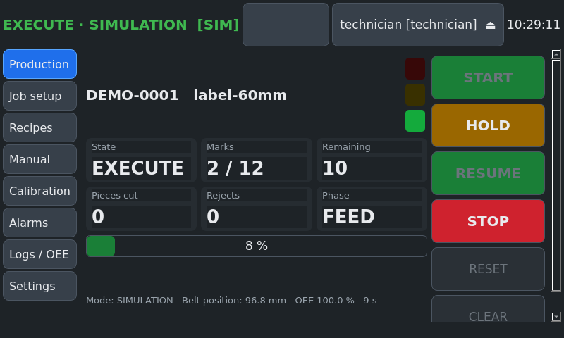

# Operator manual

Touchscreen UI on the machine (800×480). Buttons are large and can be used with gloves.

## 1. Log in

Tap **Login** (top right) and enter your PIN on the keypad.

| Role | Can |
|---|---|
| Operator | run jobs, hold/resume/stop, acknowledge alarms, export logs |
| Technician | + recipes, manual mode, calibration, simulation faults |
| Admin | + users/PINs, audit trail |

You are logged out automatically after 10 minutes without input.

## 2. Screens

| Screen | Use |
|---|---|
| **Production** | state, job, counters, progress, light tower; START / HOLD / RESUME / STOP / RESET / CLEAR |
| **Job setup** | enter a job: ID, belt width, number of marks, pitch, mark length, lead, cut mode, laser time or "done signal", delays, speed, laser stations |
| **Recipes** | load a saved job for a belt type (technician: save / duplicate / delete) |
| **Manual** | (technician) mode, jog (hold the button), feed X mm, cut now, trigger laser once |
| **Calibration** | (technician) steps/mm wizard, knife and laser tests, live sensors |
| **Alarms** | active alarms with remedy, history, acknowledge |
| **Logs / OEE** | OEE, counters, finished jobs, **export CSV to USB** |
| **Settings** | language (English / Türkçe), users, audit trail |

## 3. Daily start-up

1. Air on, main switch on. The Pi boots into the UI (about 1 minute).
2. Laser machine on, marking design loaded, foot-switch mode.
3. Check that the belt is threaded through the fork sensor, the rollers and under the laser. The first label's mark position sits under the laser.
4. **Production → RESET**. The state becomes IDLE and the knife retracts.

## 4. Running a job

1. **Recipes → select → Load** (or enter the values in **Job setup**).
2. Check the belt width message and adjust the guides.
3. Enter the job / order ID and the number of marks. The summary shows piece length and belt needed.
4. **START**, then confirm. The light turns green.
5. At the end the state is COMPLETE. The next START resets automatically.

Cut modes: **Continuous** (no cut), **Every piece**, **Every N** (sets of N labels),
**End of batch** (one cut at the end).

## 5. Hold, resume, stop

* **HOLD**: finishes the current laser mark, stops the belt, retracts the knife → HELD (yellow).
* **RESUME**: continues exactly where it stopped. Counts are kept. After a laser alarm you
  choose **RETRY** (mark the label again) or **REJECT** (count it as a reject and continue).
* **STOP**: ends the job (STOPPED). Press **RESET** before the next job.
* **E-stop**: everything stops (ABORTED, red). Remove the cause, release the E-stop, press
  the blue reset on the cabinet, then **CLEAR**, then **RESET**.

While HELD you may **jog** the belt (Manual) to re-align a new or spliced belt. The job
follows the belt.

## 6. Alarms

The top bar shows the most important alarm. Tap it for the list and the remedy. HOLD
alarms: fix the cause, then RESUME. ABORT alarms: CLEAR, then RESET.

| Code | Alarm | Reaction | What to do |
|---|---|---|---|
| E-101 | Emergency stop pressed | ABORT | Remove the cause, release the E-stop, press CLEAR, then RESET. |
| E-102 | Laser enclosure door open | HOLD | Close the laser enclosure door. The laser is inhibited in hardware while open. |
| E-103 | Safety relay not energised | ABORT | Check the safety relay, E-stop chain wiring and 24 V supply. |
| E-201 | Laser did not finish in time | HOLD | Check the laser controller screen and job file. Resume with RETRY or REJECT. |
| E-202 | Laser busy before trigger | HOLD | Wait until the laser controller is idle; check the busy signal wiring. |
| E-203 | Laser did not start after trigger | HOLD | Check that the laser is in foot-switch start mode, the job is loaded, the pedal relay wiring and the busy signal. Resume with RETRY or REJECT. |
| E-301 | Knife did not reach the extended sensor | HOLD | Check air pressure, knife blade, flow controls and the extended sensor. |
| E-302 | Knife did not return to the retracted sensor | ABORT | Lock out air, free the knife, check the retracted sensor, then CLEAR/RESET. |
| E-303 | Knife extended and retracted sensors both active | ABORT | Check the reed sensors positions and wiring. |
| E-304 | Knife not retracted before belt move | HOLD | Check the knife position and the retracted sensor. |
| E-401 | No belt at the fork sensor | HOLD | Load / splice a new belt, align it, then RESUME. Counts are kept. |
| E-402 | Belt position mismatch (slip) | HOLD | Check pinch roller pressure, belt tension and the encoder. |
| E-403 | Stepper driver fault (DM542 ALM) | ABORT | Check motor wiring, driver supply and overheating; power-cycle the driver. |
| E-404 | Belt move did not complete in time | HOLD | Check for a jam or a stalled motor. |
| E-501 | Communication with the I/O controller lost | ABORT | Check the USB cable and the Arduino power; the machine stopped safely. |
| E-502 | Air pressure low | HOLD | Check compressor, filter-regulator and the pressure switch setting. |
| E-503 | I/O controller fault (watchdog / heartbeat) | ABORT | Check the log. CLEAR and RESET to continue. |
| E-504 | Hardware rejected a command (interlock) | HOLD | Check the alarm detail; usually the knife was not retracted or a fault is set. |
| W-601 | Label rejected by vision QA | NONE | Inspect the label. Counted as reject. |
| E-602 | Too many consecutive rejects | HOLD | Check laser focus/power, belt position offset and camera. |
| W-701 | Knife blade service life reached | NONE | Replace the blade and reset the blade counter (Maintenance). |
| W-702 | Cycle time drift detected | NONE | A component is slowing down (knife, laser or feed). Plan maintenance. |
| W-703 | Job parameters invalid | NONE | Correct the job fields shown in the message. |

## 7. Changing the belt roll

When the roll ends, E-401 holds the machine. Thread or splice the new belt, align it with
jog, then **RESUME**. No count is lost.

## 8. End of shift

**Logs / OEE → Export CSV to USB** (insert a USB stick first). Leave the machine in
IDLE or STOPPED; air off if required by site rules.
