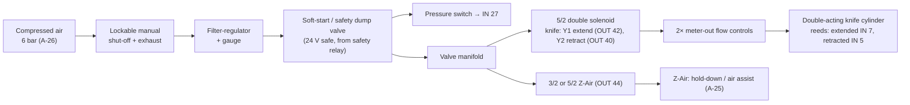

# Pneumatics

## 1. Circuit

## 2. Components and settings

| Item | Recommendation | Setting / TODO |
|---|---|---|
| Shut-off | lockable 3/2 manual valve that exhausts downstream (LOTO) | lock before any work on the knife |
| Filter-regulator | 5 µm, with gauge | working pressure: lowest value that cuts reliably (start 5 bar). TODO: record |
| Soft-start / dump valve | 24 V, fed from the safety relay | exhausts the system on E-stop, so the knife loses force |
| Pressure switch | adjustable, NO/NC contact | trip ≈ 0.5 bar below working pressure → E-502 (HOLD) |
| Knife valve | 5/2 **double solenoid** (bistable, legacy behaviour) | holds its position without power. The firmware retracts actively |
| Alternative | 5/3 closed/exhaust centre | consider with the risk assessment: knife goes force-free on power loss |
| Flow controls | meter-out on both cylinder ports | adjust for a clean cut without bouncing; target stroke 0.2–0.4 s (A-24) |
| Reed sensors | on the cylinder at both end positions | LED on at the end stop; `extended`/`retracted` must never be on together (E-303) |

## 3. Knife cycle and timing (software)

1. The belt stands still; the controller checks `knife_retracted`.
2. Y1 extend → wait for the *extended* reed (timeout `knife.extend_timeout_s`, E-301 → safe retract + HOLD).
3. Dwell `knife.dwell_s`.
4. Y2 retract → wait for *retracted* (timeout `knife.retract_timeout_s`, E-302 → ABORT).
5. Ejector DC motor pulse `knife.eject_ms`.

The firmware additionally refuses: belt motion unless retracted, and extend while the belt
moves. Measured extend/retract times are stored (`cycle_times`) for drift detection
(W-702) and shown in Calibration → knife timing test.

## 4. Adjustment procedure

1. Air off and locked. Move the knife by hand: it must run free across the full belt width.
2. Place the reeds so that each switches 1–2 mm before its end position (check with Calibration → sensor check).
3. Air on at a low pressure (3 bar). Run the knife timing test 10×, then raise the pressure until it cuts cleanly.
4. Set the flow controls for a steady motion. Record the extend/retract times as the
   baseline for the anomaly detector.
5. Set the pressure switch and test it by closing the regulator (expect E-502).
