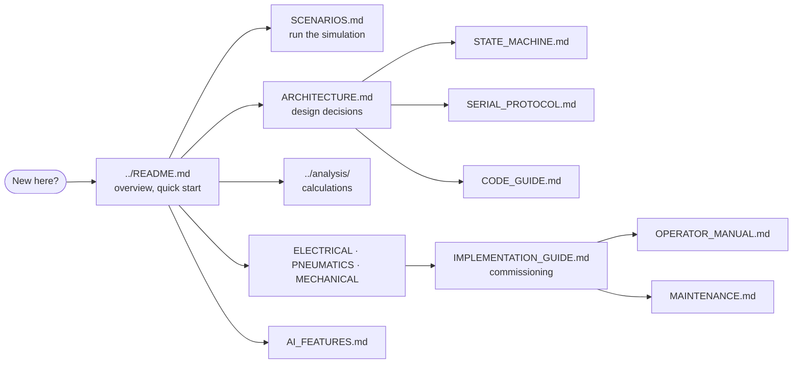

# Documentation map

| Reader | Start with |
|---|---|
| Student / researcher | README → SCENARIOS → analysis → STATE_MACHINE → CODE_GUIDE |
| Software developer | ARCHITECTURE → CODE_GUIDE → SERIAL_PROTOCOL |
| Automation / commissioning engineer | ELECTRICAL → PNEUMATICS → IMPLEMENTATION_GUIDE → ASSUMPTIONS |
| Operator | OPERATOR_MANUAL |
| Maintenance | MAINTENANCE, the alarm table in OPERATOR_MANUAL |

| Document | Content |
|---|---|
| [ARCHITECTURE](ARCHITECTURE.md) | layers, packages, topics, design decisions (why each technology) |
| [STATE_MACHINE](STATE_MACHINE.md) | states, modes, job sequence, alarm catalogue, light tower |
| [SERIAL_PROTOCOL](SERIAL_PROTOCOL.md) | Pi ↔ Arduino frames, reliability rules |
| [CODE_GUIDE](CODE_GUIDE.md) | code tour and how to extend it |
| [SCENARIOS](SCENARIOS.md) | 12 simulation scenarios: commands, UI steps, expected results |
| [AI_FEATURES](AI_FEATURES.md) | vision QA (OpenCV, YOLO), drift detection, assistant, NL jobs |
| [ELECTRICAL](ELECTRICAL.md) | power, safety chain, laser pedal wiring, pin map |
| [PNEUMATICS](PNEUMATICS.md) | knife circuit, adjustment |
| [MECHANICAL](MECHANICAL.md) | layout, cabinet, BOM with costs |
| [IMPLEMENTATION_GUIDE](IMPLEMENTATION_GUIDE.md) | step-by-step commissioning with checklists |
| [OPERATOR_MANUAL](OPERATOR_MANUAL.md) | daily use, alarms |
| [MAINTENANCE](MAINTENANCE.md) | schedule, spare parts, backups |
| [ASSUMPTIONS](ASSUMPTIONS.md) | values still to be measured on the machine |
| [../analysis](../analysis/README.md) | engineering calculations with formulas |
