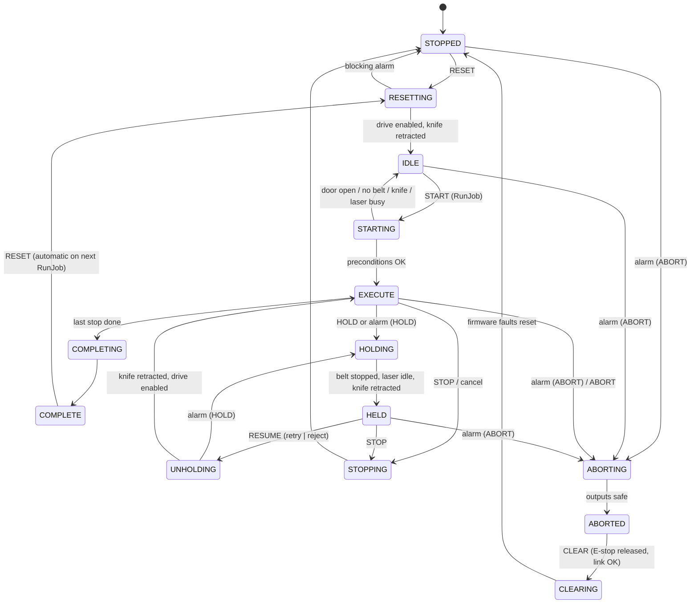
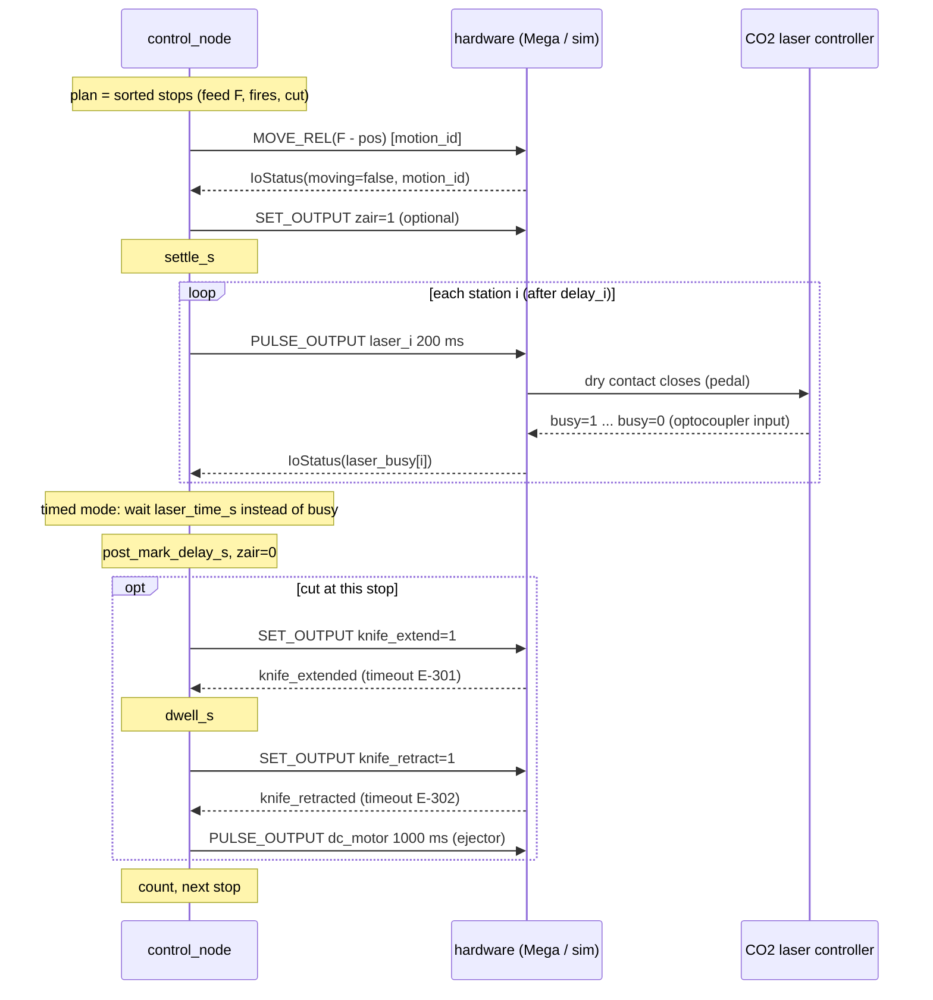

# State machine, job sequence and alarms

Implementation: [`belt_marking_control/core/controller.py`](../ros2_ws/src/belt_marking_control/belt_marking_control/core/controller.py)
(pure Python, ticked at 100 Hz). The model follows PackML / ISA-TR88.00.02, reduced to
what a single-axis marking machine needs. SUSPENDED is not used; material starvation is
handled as HOLD.

## 1. States

ABORT is accepted from every state except ABORTING/ABORTED. The diagram shows only the
common edges.

| State | Machine does | Leaves when |
|---|---|---|
| STOPPED | nothing; releases the stepper after `machine.drive_release_s` | RESET |
| RESETTING | reset firmware faults, enable drive, retract knife, all lasers/Z-Air off | knife retracted + drive enabled → IDLE |
| IDLE | ready, holding torque on | START |
| STARTING | checks door closed, belt present, knife retracted, lasers idle; stores the job origin | all OK → EXECUTE, else → IDLE (W-703 with reason) |
| EXECUTE | runs the plan (below) | end of plan / HOLD / STOP / ABORT |
| HOLDING | decelerates the belt, waits for a running laser job, retracts the knife, Z-Air off | all safe → HELD |
| HELD | waits for the operator. **Jog is allowed** and re-aligns the plan (the origin moves with the jog) | RESUME / STOP |
| UNHOLDING | laser-timeout recovery (`retry` re-triggers, `reject` counts a reject), re-arms delays | → EXECUTE |
| COMPLETING | Z-Air off, waits for standstill, writes the job record | → COMPLETE |
| STOPPING | controlled stop, waits for the laser (≤ 10 s), retracts the knife | → STOPPED (job ends as STOPPED) |
| ABORTING | quick stop, lasers/Z-Air/ejector off, knife retract valve on (if powered) | immediately → ABORTED |
| ABORTED | outputs safe; the hardwired safety relay may have removed power | CLEAR |
| CLEARING | `RESET_FAULTS` on the firmware, acknowledges inactive alarms | → STOPPED |

### Modes

| Mode | Allows |
|---|---|
| AUTO | RunJob. No manual functions |
| MANUAL | jog, feed X mm, cut now, trigger laser once, home (zero) in STOPPED/IDLE/COMPLETE |
| MAINTENANCE | MANUAL + force auxiliary outputs (Z-Air, ejector, light tower, buzzer), calibration |
| SIMULATION | AUTO on simulated hardware (`use_sim:=true`); fault injection enabled in the UI |

The mode can only change in STOPPED, IDLE, COMPLETE or ABORTED. Knife and laser outputs can
never be forced directly. They are only driven through the knife cycle and laser trigger
functions, which keep the interlocks.

## 2. Job sequence (one stop)

Firmware interlocks, which the plant model also enforces:
- no belt move unless the knife is retracted;
- no knife extend while the belt moves;
- no motion or outputs while E-stop / heartbeat-lost is latched.

## 3. Alarms

The alarm catalogue is defined in `core/alarms.py`. Reactions: **HOLD** (resume possible),
**ABORT** (CLEAR + RESET). Condition alarms stay *active* while the cause is present.
Event alarms become inactive immediately but stay listed until acknowledged. RESUME,
RESET and CLEAR acknowledge alarms whose condition has gone.

| Code | Name | Severity | Reaction | Trigger |
|---|---|---|---|---|
| E-101 | ESTOP | fatal | ABORT | E-stop monitor input open |
| E-102 | DOOR_OPEN | error | HOLD | laser enclosure door open during a job or a manual laser shot |
| E-103 | SAFETY_RELAY | fatal | ABORT | safety relay not energised while the E-stop is OK |
| E-201 | LASER_TIMEOUT | error | HOLD | busy still high after `time·factor + margin` |
| E-202 | LASER_BUSY_BEFORE_TRIGGER | error | HOLD | laser busy before we trigger (signal mode) |
| E-203 | LASER_NO_ACK | error | HOLD | busy never rose within `ack_timeout_s` |
| E-301 | KNIFE_EXTEND_TIMEOUT | error | HOLD | extended sensor not reached (knife is retracted automatically) |
| E-302 | KNIFE_RETRACT_TIMEOUT | fatal | ABORT | retracted sensor not reached |
| E-303 | KNIFE_SENSOR_CONFLICT | fatal | ABORT | both reed sensors active |
| E-304 | KNIFE_NOT_RETRACTED | error | HOLD | knife not home before a feed / on resume |
| E-401 | BELT_MISSING | error | HOLD | fork sensor sees no belt during a job |
| E-402 | BELT_SLIP | error | HOLD | encoder vs. commanded position > tolerance (encoder option) |
| E-403 | DRIVER_FAULT | fatal | ABORT | DM542 ALM output |
| E-404 | MOTION_TIMEOUT | error | HOLD | move not finished in 1.5 × planned time + margin |
| E-501 | SERIAL_LINK_LOST | fatal | ABORT | no `IoStatus` for 0.5 s |
| E-502 | LOW_AIR | error | HOLD | air pressure switch open |
| E-503 | FIRMWARE_FAULT | fatal | ABORT | firmware heartbeat-lost / watchdog-reset flag |
| E-504 | HW_COMMAND_REJECTED | error | HOLD | firmware refused a command (interlock) |
| W-601 | VISION_REJECT | warning | – | label rejected by vision QA (counted) |
| E-602 | CONSECUTIVE_REJECTS | error | HOLD | `machine.consecutive_reject_limit` rejects in a row |
| W-701 | KNIFE_BLADE_LIFE | warning | – | `knife.blade_life_cycles` reached |
| W-702 | CYCLE_DRIFT | warning | – | anomaly detector: cycle time drift |
| W-703 | JOB_INVALID | warning | – | job refused (validation / start preconditions) |

## 4. Light tower

| Condition | Red | Yellow | Green | Buzzer |
|---|---|---|---|---|
| EXECUTE, no alarm | | | ● | |
| HOLDING/HELD/STARTING/COMPLETE…, MANUAL/MAINT mode, warnings | | ● | | |
| any ERROR/FATAL alarm listed, ABORTED | ● | | | while active & unacknowledged |
